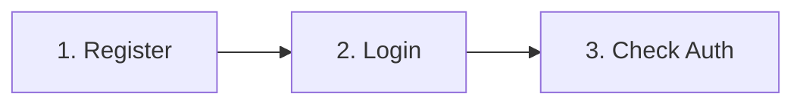

# Guide de test API avec Postman

Ce guide vous aide à tester l'ensemble de l'API Chrono Explorer à l'aide de Postman, en expliquant l'ordre des requêtes et comment les configurer correctement.

## Collection Postman

Vous pouvez importer la collection complète depuis le fichier `Chrono-Explorer.postman_collection.json` inclus dans ce dépôt.

## Prérequis

1. Assurez-vous que tous les services sont en cours d'exécution :
   - Gateway Service (port 8080)
   - Auth Service (port 8081)
   - Media Service (port 8082)
   - Event Service (port 8083)
   - Bases de données MySQL (via Docker)

2. Paramètres globaux à configurer dans Postman :
   - `gateway_url`: http://localhost:8080
   - `enable_cookies`: true (dans les paramètres de la collection)

## Ordre des requêtes

⚠️ **IMPORTANT**: Les requêtes doivent être exécutées dans l'ordre indiqué car elles dépendent les unes des autres, notamment pour l'authentification.

### 1. Authentification



#### 1.1. Enregistrement d'un utilisateur

```
POST {{gateway_url}}/api/auth/register
```

**Body** (form-data ou x-www-form-urlencoded) :
- `email`: votre_email@example.com
- `password`: votre_mot_de_passe

**Résultat attendu**: Status 200 OK

#### 1.2. Connexion

```
POST {{gateway_url}}/api/auth/login
```

**Body** (form-data ou x-www-form-urlencoded) :
- `email`: votre_email@example.com
- `password`: votre_mot_de_passe

**Résultat attendu**: 
- Status 200 OK
- Response body: `true`
- Cookie `jwt` défini automatiquement (vérifie dans l'onglet "Cookies")

> 📌 **Note importante**: Postman conservera automatiquement le cookie JWT pour toutes les requêtes suivantes si vous avez activé la gestion des cookies pour cette collection.

#### 1.3. Vérification de l'authentification

```
GET {{gateway_url}}/api/auth/check
```

**Résultat attendu**: 
- Status 200 OK
- Détails de l'utilisateur en JSON

### 2. Gestion des civilisations

#### 2.1. Création d'une civilisation

```
POST {{gateway_url}}/api/event/civilizations
```

**Headers**:
- Content-Type: application/json

**Body** (raw JSON):
```json
{
  "name": "Empire Romain",
  "description": "L'Empire romain est le nom donné au régime politique et au territoire ayant succédé à la République romaine.",
  "startDate": "-0027-01-16",
  "endDate": "0476-09-04"
}
```

**Résultat attendu**: 
- Status 201 Created
- ID de la civilisation dans la réponse (à conserver pour les étapes suivantes)

#### 2.2. Récupération des civilisations

```
GET {{gateway_url}}/api/event/civilizations
```

**Résultat attendu**:
- Status 200 OK
- Liste des civilisations en JSON

### 3. Gestion des événements

#### 3.1. Création d'un événement

```
POST {{gateway_url}}/api/event/events
```

**Headers**:
- Content-Type: application/json

**Body** (raw JSON):
```json
{
  "title": "Fondation de Rome",
  "date": "-0753-04-21",
  "description": "Selon la légende, Rome est fondée par Romulus et Remus sur les rives du Tibre.",
  "civilizationId": 1
}
```
> ⚠️ Remplacez `civilizationId` par l'ID obtenu à l'étape 2.1

**Résultat attendu**: 
- Status 201 Created
- ID de l'événement dans la réponse (à conserver pour les étapes suivantes)

#### 3.2. Récupération des événements

```
GET {{gateway_url}}/api/event/events
```

**Résultat attendu**:
- Status 200 OK
- Liste des événements en JSON

#### 3.3. Récupération des événements d'une civilisation

```
GET {{gateway_url}}/api/event/civilizations/1/events
```
> ⚠️ Remplacez `1` par l'ID obtenu à l'étape 2.1

**Résultat attendu**:
- Status 200 OK
- Liste des événements de la civilisation en JSON

### 4. Gestion des médias

#### 4.1. Ajout d'un média

```
POST {{gateway_url}}/api/media
```

**Headers**:
- Content-Type: application/json

**Body** (raw JSON):
```json
{
  "url": "https://upload.wikimedia.org/wikipedia/commons/d/d8/Ara_pacis_roma.JPG",
  "type": "IMAGE",
  "eventId": 1
}
```
> ⚠️ Remplacez `eventId` par l'ID obtenu à l'étape 3.1

**Résultat attendu**:
- Status 201 Created
- Détails du média créé en JSON

#### 4.2. Récupération des médias d'un événement

```
GET {{gateway_url}}/api/media/event/1
```
> ⚠️ Remplacez `1` par l'ID obtenu à l'étape 3.1

**Résultat attendu**:
- Status 200 OK
- Liste des médias de l'événement en JSON

### 5. Gestion des commentaires

#### 5.1. Ajout d'un commentaire

```
POST {{gateway_url}}/api/event/comments
```

**Headers**:
- Content-Type: application/json

**Body** (raw JSON):
```json
{
  "content": "Quelle époque fascinante !",
  "eventId": 1
}
```
> ⚠️ Remplacez `eventId` par l'ID obtenu à l'étape 3.1

**Résultat attendu**:
- Status 201 Created
- Détails du commentaire créé en JSON

#### 5.2. Récupération des commentaires d'un événement

```
GET {{gateway_url}}/api/event/events/1/comments
```
> ⚠️ Remplacez `1` par l'ID obtenu à l'étape 3.1

**Résultat attendu**:
- Status 200 OK
- Liste des commentaires de l'événement en JSON

### 6. Déconnexion

```
POST {{gateway_url}}/api/auth/logout
```

**Résultat attendu**:
- Status 200 OK
- Cookie JWT supprimé

## Résolution des problèmes courants

### Erreur 401 Unauthorized
- Vérifiez que vous êtes bien connecté (étape 1.2)
- Vérifiez que les cookies sont activés dans la collection Postman
- Réexécutez la requête de connexion pour obtenir un nouveau token

### Erreur 404 Not Found
- Vérifiez que tous les services sont démarrés
- Vérifiez que vous utilisez les bonnes URLs
- Vérifiez que la Gateway est correctement configurée

### Erreur 500 Internal Server Error
- Vérifiez les logs du service concerné
- Vérifiez que les bases de données sont accessibles

## Collection Postman complète

Voici la structure complète de la collection Postman fournie :

```
Chrono Explorer API
├── 1. Authentification
│   ├── Register
│   ├── Login
│   ├── Check Auth
│   └── Logout
├── 2. Civilisations
│   ├── Créer une civilisation
│   └── Liste des civilisations
├── 3. Événements
│   ├── Créer un événement
│   ├── Liste des événements
│   └── Événements par civilisation
├── 4. Médias
│   ├── Ajouter un média
│   └── Médias par événement
└── 5. Commentaires
    ├── Ajouter un commentaire
    └── Commentaires par événement
``` 