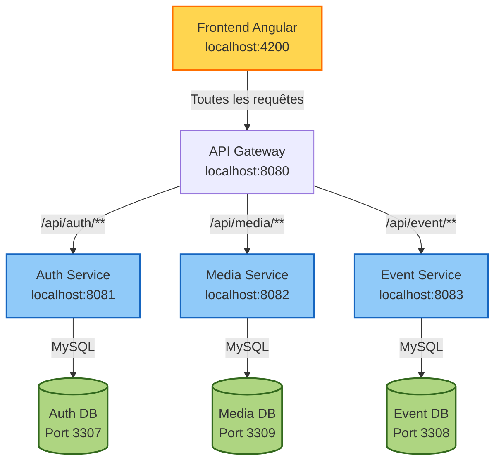
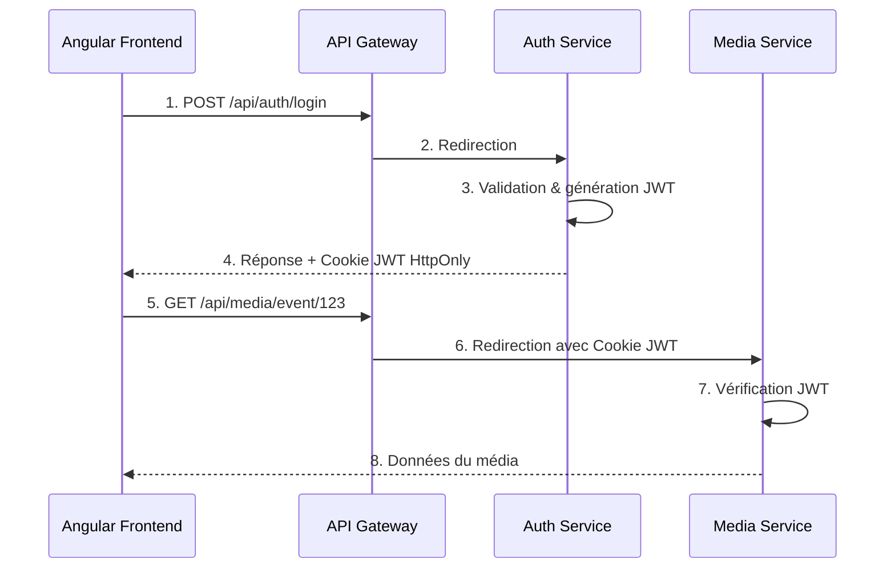
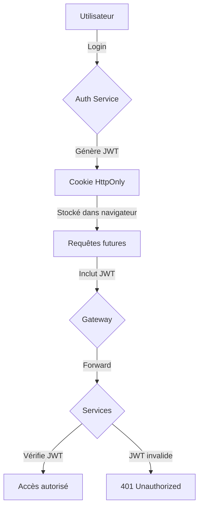
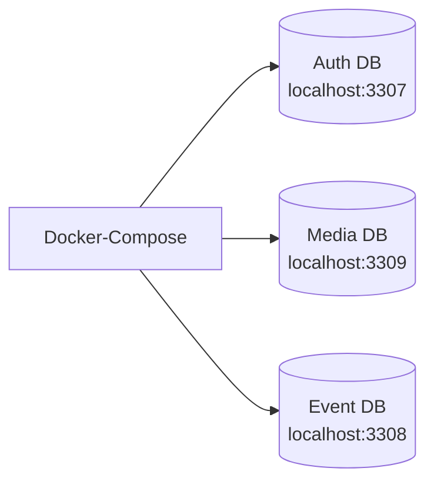

# Chrono Explorer - Architecture Microservices

Ce projet implémente une architecture microservices complète pour l'application Chrono Explorer, construite avec Spring Boot 3.4.5 et Java 21.

## Table des matières
- [Architecture globale](#architecture-globale)
- [Services](#services)
- [Communication](#communication)
- [Sécurité & Authentification](#sécurité--authentification)
- [Configuration des bases de données](#configuration-des-bases-de-données)
- [Installation & Démarrage](#installation--démarrage)
- [Tests avec Postman](#tests-avec-postman)
- [Développement](#développement)

## Architecture globale

L'application est divisée en microservices indépendants qui communiquent via HTTP.



## Services

### Gateway Service (Port 8080)
- **Rôle**: Point d'entrée unique pour toutes les requêtes
- **Technologie**: Spring Cloud Gateway
- **Configuration**: Redirection des requêtes vers les services appropriés
- **CORS**: Configure pour accepter les requêtes du frontend Angular (localhost:4200)

### Auth Service (Port 8081)
- **Rôle**: Gestion des utilisateurs et authentification
- **Endpoints**:
  - `/api/auth/register`: Enregistrement d'un nouvel utilisateur
  - `/api/auth/login`: Connexion avec génération de JWT
  - `/api/auth/check`: Vérification d'un token JWT
  - `/api/auth/logout`: Déconnexion (suppression du cookie)
- **Sécurité**: Génération et validation des JWT, gestion des cookies HttpOnly

### Media Service (Port 8082)
- **Rôle**: Gestion des médias (images, vidéos YouTube)
- **Endpoints**:
  - `/api/media`: Ajout d'un nouveau média
  - `/api/media/event/{eventId}`: Récupération des médias pour un événement
- **Sécurité**: Intercepte et valide le JWT dans les cookies

### Event Service (Port 8083)
- **Rôle**: Gestion des événements historiques et commentaires
- **Endpoints**:
  - Gestion des événements historiques
  - Gestion des commentaires associés
  - Gestion des civilisations
- **Sécurité**: Intercepte et valide le JWT dans les cookies

## Communication



### Principes clés:
1. **Découplage total**: Aucune dépendance directe entre services
2. **Références par ID**: Les services stockent des références (eventId) sans connaître les détails
3. **JWT dans cookies HttpOnly**: Sécurité renforcée contre les attaques XSS

## Sécurité & Authentification

### Flux d'authentification



### JWT (JSON Web Token)
- **Clé secrète partagée**: Tous les services utilisent la même clé JWT pour la validation
- **Stockage sécurisé**: Token stocké uniquement dans un cookie HttpOnly
- **Validation côté serveur**: Chaque service valide le token indépendamment

## Configuration des bases de données

Le projet utilise Docker pour fournir les bases de données MySQL:



### Configuration Docker
Le fichier `docker-compose.yml` définit trois conteneurs MySQL:
- **mysql-auth**: Port 3307, DB: auth_db
- **mysql-event**: Port 3308, DB: event_db
- **mysql-media**: Port 3309, DB: media_db

Chaque service se connecte à sa propre base de données avec les identifiants:
- Username: chrono
- Password: chrono_pass

## Installation & Démarrage

### Prérequis
- Java 21
- Maven
- Docker & Docker Compose
- Node.js & Angular CLI (pour le frontend)

### Étapes de démarrage

1. **Lancer les bases de données**:
```bash
docker-compose up -d
```

2. **Compiler et démarrer les services** (dans des terminaux séparés):
```bash
   # Auth Service
cd auth-service
   mvn spring-boot:run

   # Media Service
cd media-service
   mvn spring-boot:run

   # Event Service
cd event-service
   mvn spring-boot:run
   
   # Gateway Service
   cd gateway-service
   mvn spring-boot:run
   ```

3. **Vérifier le fonctionnement**:
   - Gateway: http://localhost:8080
   - Auth Service: http://localhost:8081
   - Media Service: http://localhost:8082
   - Event Service: http://localhost:8083

## Tests avec Postman

Voir le fichier [POSTMAN_GUIDE.md](./POSTMAN_GUIDE.md) pour un guide détaillé des tests API et les collections Postman.

## Développement

### Structure du projet
```
BACKEND-CE/
├── auth-service/       # Service d'authentification
├── event-service/      # Service de gestion des événements
├── gateway-service/    # API Gateway
├── media-service/      # Service de gestion des médias
├── docker-compose.yml  # Configuration Docker
├── README.md           # Ce fichier
└── POSTMAN_GUIDE.md    # Guide Postman
```

### Modification des services

Lors de la modification ou de l'extension des services, assurez-vous de:
1. Maintenir la même clé JWT dans tous les services
2. Respecter les conventions de nommage des routes
3. Implémenter la validation JWT pour les nouveaux endpoints
4. Configurer correctement les CORS si nécessaire
